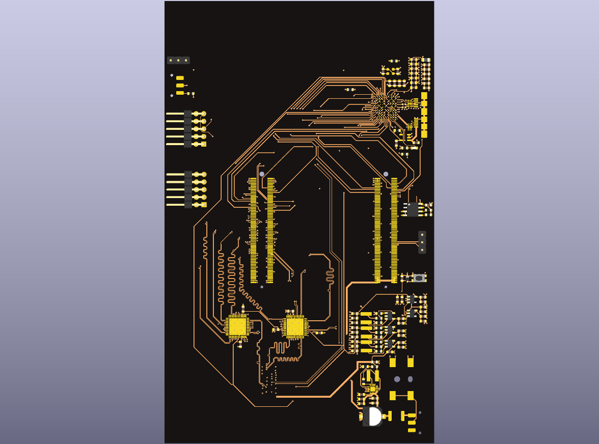

# `carrier_board/` — camera + radar carrier

The board everything else plugs into: the camera, the radar, the FPGA module,
the impact microphone, Ethernet, and the power tree.

Two revisions live here. **`ov9281/` is the current design and is a work in
progress** — the schematics are complete, the PCB layout is not yet drawn.
`imx477/` is the earlier revision, superseded but kept because it is the one
with a finished layout.

---

## `ov9281/` — current revision (work in progress)

Built around the **OV9281 global-shutter sensor**. Its interfaces:

| Sheet | Interface |
|---|---|
| `extension.kicad_sch` (CAM) | Camera **FPC connector**; the sensor's MIPI CSI-2 lanes into a **TC358748XBG** bridge, which presents them as a parallel bus (PD0–PD23, PCLK, HVALID, VVALID) the FPGA captures directly. PCA9543 I²C switch and TXS0108E level shifters alongside |
| `FPGA.kicad_sch` | **140-pin board-to-board connector** (2×70, 0.5 mm) carrying the parallel camera bus, radar bus and control to the FPGA module; JTAG; and the **I²S audio headers** (BCLK / LRCLK / SD) for the impact microphone |
| `FMCW.kicad_sch` | **40-pin shielded FPC connector** to the radar front-end, with TXS0108E level translation |
| `ETH.kicad_sch` | **Gigabit Ethernet**: RTL8211F-CG PHY, HY911130A RJ45 with integrated magnetics, SN74LVC2G34 buffers |
| `power.kicad_sch` | 12 V barrel jack → TPS54302 buck and TPS74801 LDO rails |
| `footprints/` | Project-local footprint libraries |

**Layout status: not started.** `ov9281/` is schematics only — there is no
`.kicad_pcb` in this revision.

### Why Ethernet and not USB 3.0

The IMX477 revision used a CYUSB3014 for the host link. That part is a
**121-ball TFBGA**, which is not realistically hand-reflowable, and it dictated
the whole main-board stackup and layout. The OV9281 revision drops it for
gigabit Ethernet through an RTL8211F, which is a QFN and reflows by hand
without difficulty.

That change also settled the processing split. Because frames are **buffered in
DDR and then sent to a PC for processing**, rather than being consumed live on
the FPGA, the **on-FPGA blob-detection logic from the IMX477 era is obsolete**.
The FPGA's job is now capture, buffer, and offload; detection, trajectory
fitting and spin estimation all happen on the host. The radar path in
[`../fpga`](../fpga) follows the same store-and-forward pattern.

---

## `imx477/` — earlier revision (obsolete)

Built around the **IMX477**, split across a `main_board/` (FPGA module, USB 3.0
host link, power) and a separate `sensor_board/`, joined by a DF40C/DF40HC
60-pin board-to-board pair.

**The IMX477 is obsolete for this application, and this revision is not
optimized.** The sensor is rolling-shutter, which smears a fast-moving ball
across the frame in a way no amount of downstream processing recovers — a
global-shutter sensor is the requirement, and that is what the OV9281 revision
exists to satisfy. The USB 3.0 host path is the second reason it was dropped
(see above).

It is kept here because it is the only revision that carries a completed PCB
layout, and because its power tree and B2B pinout carry over.

| Path | Contents |
|---|---|
| `imx477/main_board/main_board.kicad_pro` / `.kicad_sch` / `.kicad_pcb` | KiCad project, schematics, and the finished layout |
| `imx477/main_board/USB3.kicad_sch` | CYUSB3014 USB 3.0 controller, AT24CM02 config EEPROM, VBUS switching — the path replaced by Ethernet |
| `imx477/main_board/FPGA.kicad_sch` | 2×70 B2B to the FPGA module, JTAG |
| `imx477/main_board/extension.kicad_sch` | DF40HC 60-pin B2B to the sensor board |
| `imx477/main_board/power.kicad_sch` | TLV62130 / AP3417C / MIC5504 rails |
| `imx477/sensor_board/` | The IMX477 sensor board: `sensors.kicad_sch`, `power.kicad_sch`, and its layout |
| `imx477/footprints/` | Project-local footprint libraries |



---

## `mechanical/`

`CS-mount.FCStd` — a FreeCAD CS-mount lens holder, drawn for the IMX477 sensor
board. `lens_spec.png` records the optics it was sized around: a 4 mm lens
giving roughly 90° horizontal field of view, paired with 940 nm IR flood
illumination so exposures stay short enough for 200 fps and above.

---

## Opening the boards

```
kicad carrier_board/ov9281/hardware.kicad_pro           # KiCad 8 or newer
kicad carrier_board/imx477/main_board/main_board.kicad_pro
kicad carrier_board/imx477/sensor_board/sensor_board.kicad_pro
```

The render above was produced with `kicad-cli pcb render`.
