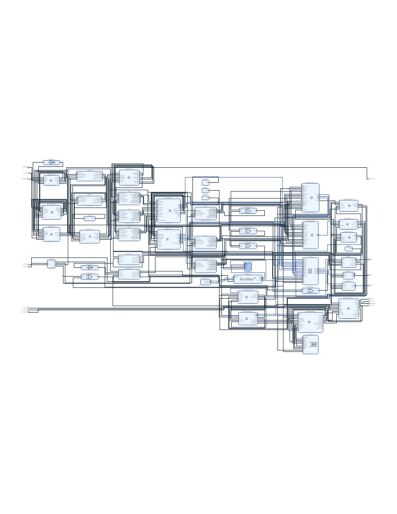

# `fpga/` — Artix-7 range–Doppler–CFAR backend



The digital half of the platform. It ingests raw ADAR7251 PPI bytes from
[`../rf_frontend`](../rf_frontend), turns them into three per-receiver complex
range–Doppler maps plus a summed power map and a packed CFAR detection map in
DDR3, and — once per shot — ships one selected frame to a host PC over UDP.

Everything that has to run at line rate is in fabric. Everything that benefits
from floating point and libraries (clustering, tracking, angle-of-arrival, the
spin-axis interferometry) is deliberately not: it runs on the host, on a frame
the FPGA has already reduced to ~516 KiB.

## Pipeline

```
 ADAR7251 PPI bytes
        │
   01   ├─ adar7251_ppi_rx          byte capture, channel framing
   01b  ├─ ppi_to_tdm_bridge
   02   ├─ tdm_mux_3to1             3 RX → one tagged TDM stream
        ├─ FIR Compiler             band-pass + Hilbert (quadrature by DSP,
        │                           not by a hardware I/Q receiver)
   03   ├─ iq_delay_align           matches the Hilbert group delay on I
   04   ├─ iq_demux_1to3            back out to 3 per-RX lanes
        ├─ xfft ×3                  range FFT, 128 bins
   05a  ├─ scatter_write_3rx  ─────► DDR region A   (transposed / range-major,
        │                                            ping-pong)
   05b  ├─ doppler_seq_3rx    ◄─────  reads each range bin as one burst
        ├─ xfft ×3                  Doppler FFT, 256 bins
   06b  ├─ cplx_cell_cache_top ────► DDR region B   3 × complex RD map, 384 KiB
   06a  ├─ noncoh_integrator        Σ|X|² across the 3 receivers
   07a  ├─ rd_map_collector_summed ► DDR region C   summed power map, 128 KiB
   08   └─ cfar_detector      ─────► DDR region D   packed detections, 4 KiB
```

**Grid:** 128 range bins × 256 Doppler bins. **Corner turn:** done in the DDR
address map rather than in a transpose buffer — the range-FFT scatter writer
stores each receiver's output range-major, so the Doppler sequencer reads each
range bin as a single contiguous burst.

**Publication protocol:** region A ping-pongs on its own; B, C and D switch
together on one `frame_buf_sel` bit, so software can never read region B from
one frame and region D from another. `rtl/radar_params.vh` is the single source
of truth for the geometry and the whole address map.

## Host offload

The FPGA does not stream continuously. It buffers, waits for a trigger, then
sends exactly one frame:

```
DDR3 ─AXI4─► radar_frame_dump_streamer ─AXIS─► radar_udp_packetizer ─► FIFO ─► udp_tx ─► PHY ─► host
```

Region A is not dumped — B is the Doppler transform of A, so A is redundant for
every target metric, and it has an independent ping-pong that would need
freezing to stay coherent. B + C + D is ~516 KiB per shot, 1040-byte UDP
packets, 16-byte big-endian header. `host/recv_radar_frame_udp.py` reassembles
it and can render the range–Doppler map.

`host/README.md` has the packet format, the region table, and the block-design
wiring.

## Layout

| Path | Contents |
|---|---|
| [`rtl/`](rtl/) | The pipeline, numbered in dataflow order `01_adar7251_ppi_rx.v` … `08_cfar_detector.v`, plus `radar_params.vh` |
| [`host/`](host/) | Frame sequencer, DDR dump streamer, UDP packetizer, AXI-Lite control registers, their testbenches, and the Python host receiver — see [`host/README.md`](host/README.md) |
| [`firmware/`](firmware/) | MicroBlaze C: `audio_dsp` (I2S impact detector) and `fusion_control` (the trigger FSM) |
| [`sim/`](sim/) | Unit tests and the raw-ADC-to-CFAR end-to-end run — see [`sim/README.md`](sim/README.md) |
| [`utilization/`](utilization/) | Per-module out-of-context utilization reports and their `summary.txt` |
| [`docs/`](docs/) | Block diagram, resource-breakdown and timing-budget figures, and `block_design.pdf` (the full Vivado block design) |

## Firmware (`firmware/`)

`audio_dsp.c` is the impact detector: an INMP441 over AXI-I2S into a DMA'd
ring buffer, then high-pass → onset detection → feature extraction →
club/no-club classification. It forwards labels to the trigger FSM and never
resets it.

`fusion_control.c` is the trigger FSM: on a club label it arms a short window;
for each completed frame it scans the region-C summed power map already in DDR
for peak, mean, SNR and the peak's Doppler velocity; the first armed frame that
clears both the speed and the SNR gate requests that frame's dump and asserts
`halt`, so the 2-deep ping-pong cannot overwrite the chosen frame while it
streams. With only two buffer sets, "remember the best frame across the whole
trajectory" is not available — first-over-threshold with an early stop is.

> **`fusion_control.c` is still a work in progress.** The state machine and the
> host-testable scaffolding are there (`-DTRIG_TESTBENCH`), but the gates in
> `fusion_control.h` are placeholders: `TRIG_VEL_RES_CMS` in particular must be
> derived from the real chirp rate and PRF rather than the value currently
> stubbed in, and the DDR region-C scan is not yet wired to the AXI register
> block that pulses `start`.

## Resource utilization (`utilization/`)

Out-of-context synthesis of every block-design IP plus the RTL, targeting
`xc7a100tfgg484-2`. The radar datapath itself is small — 942 LUT and 6 DSP for
every hand-written module except CFAR — and total device usage is dominated by
the AXI SmartConnect (~24.5k LUT), the MIG (~5.2k LUT) and MicroBlaze (~1.2k
LUT). The design fits comfortably on `xc7a100t` at ~58% LUT; it does not fit
`xc7a35t` without reducing the interconnect.

> Read `summary.txt`'s `cfar_streaming_axi_verilog` row and its `TOTAL` with
> care. Synthesized out of context, CFAR's 37-row sliding window infers as
> registers and F7/F8 muxes rather than BRAM (that row reports 0 BRAM against
> 702k FF), so both it and the summed total are artifacts of OOC synthesis, not
> the in-context cost. The per-module rows for everything else are
> representative.

## Building and running

Unit tests need only Icarus Verilog:

```bash
bash sim/run_unit_tests.sh          # expect RESULT: PASS from each testbench
```

The end-to-end simulation instantiates the real Xilinx FFT and FIR IP, so it
needs Vivado and a generated block design:

```bash
export VIVADO_SETTINGS=/path/to/Vivado/settings64.sh
export BD_GEN=/path/to/<project>.gen/sources_1/bd/<bd_name>
bash sim/run_e2e_3rx.sh             # ~30 min with the real FFT IP
```

The Vivado project itself (`.runs`, `.gen`, `.cache` — several hundred MB of
generated output) is not tracked. `docs/block_design.pdf` is the block design it
builds; regenerate the IP in Vivado before running the end-to-end simulation.
