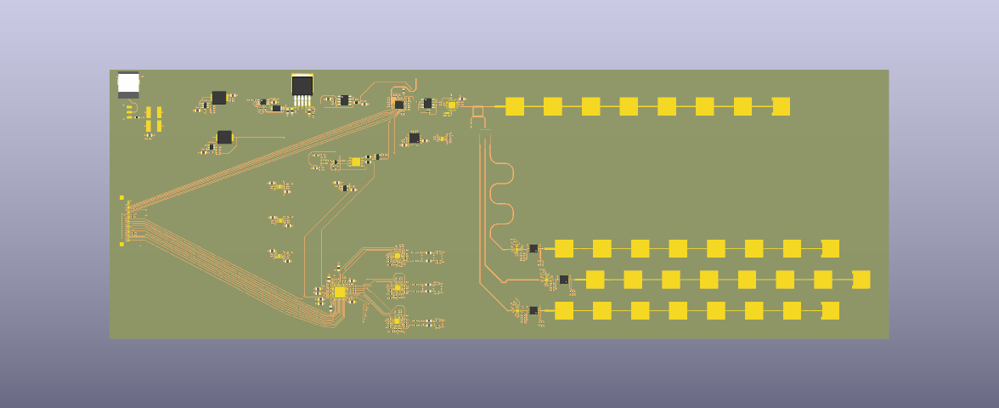

# `rf_frontend/` — 10 GHz 1TX/3RX FMCW front-end



The analog half of the platform: a coherent FMCW radar that sweeps 192 MHz
around 10 GHz in 108 µs, radiates it from a series-fed patch column, and lands
three receive chains on an ADAR7251's simultaneously-sampled ADC channels.
Simultaneous sampling is the point — it is what preserves the inter-receiver
phase that angle-of-arrival and the spin-axis interferometer downstream consume.

Everything is discrete MMIC rather than an integrated transceiver, so each
channel's gain, noise figure and LO drive is set and measurable on its own.

## Signal chain

```
                     ┌──────────────┐
  KT2520K ──ref──►   │   ADF4159    │  fractional-N ramp PLL, type 2
                     │  ramp gen +  │──── CP ──► ADA4625-1 loop filter ──┐
                     │     PFD      │                                    │
                     └──────▲───────┘                                    ▼
                            │ ÷2 output (feedback only)          ┌──────────────┐
                            └────────────────────────────────────│   HMC1163    │
                                                                 │ 10 GHz VCO   │
                                                                 └──────┬───────┘
                                                        11 dBm fundamental
                                                                        │
                                        ┌───────── 4 dB branchline coupler ─────────┐
                                        │                                           │
                              TX patch column                          1 → 3 Wilkinson tree
                                (+7 dBm radiated)                       │      │      │
                                                                        ▼      ▼      ▼
     RX column ×3 ──► PMA3-14LN+ ──► LTC5548 ◄──────────────────────── LO (≈0 dBm at each mixer)
                       (+22.6 dB)      │
                                       ▼
                                  ADA4940-2 differential IF driver ──► ADAR7251 (4 ch, 16-bit)
```

Key consequence of the LNA-first ordering: the LNA contributes no line of its
own to the link budget — it lifts signal and noise together — but it is why the
cascaded noise figure is ≈2 dB rather than the ≈12 dB of a mixer-first chain.
The LTC5548's ≈8.5 dB conversion loss enters only as added noise, divided down
by the LNA gain.

## Key components

| Function | Part |
|---|---|
| Ramp PLL (fractional-N, type 2) | ADF4159 |
| VCO, 10 GHz fundamental + ÷2 | HMC1163 |
| Loop-filter amplifier (JFET input) | ADA4625-1 |
| Reference oscillator / buffer | KT2520K, NB3N551 |
| LNA, ×3 | PMA3-14LN+ |
| Downconversion mixer, ×3 | LTC5548 |
| Differential IF driver | ADA4940-2 |
| ADC — 4 channels, simultaneous sampling | ADAR7251 |
| LO distribution | 4 dB branchline coupler + 1→3 Wilkinson splitter (both distributed, on-board) |
| Pad attenuators | PAT1220 (4 dB / 6 dB) |
| Supplies | TPS7A4701 and TPS7A91 (low-noise LDO for the RF rails), TPS54302, MIC29302A, ADP1613 boost |
| Host interface | 40-pin shielded FPC to the carrier board |

## Antenna array

Three receive columns plus one transmit column, all series-fed patches on the
top layer:

- **Series-fed columns, not single patches.** On this substrate a lone patch
  radiates poorly at 10 GHz; an 8-element column reaches ≈15.5 dBi directivity
  and ≈8.5 dBi realized gain at ≈18% radiation efficiency, so the column's
  directivity buys back most of what the dielectric burns as heat.
- **Staggered "^" geometry.** Adjacent phase centres are stepped λ/2 (15 mm) in
  *both* array axes, so neither measured adjacent-pair phase ever wraps, and
  their sum supplies a full-λ baseline whose ambiguity is already spent. The
  solve stays unambiguous across ±90° on both principal axes.
- **TX–RX separation of 75 mm** — simultaneously the isolation the array needs
  and the largest separation the LO trace-loss budget allows.

## Substrate

Isola 370HR, Dk 3.92, tanδ 0.025, 0.254 mm dielectric. It is a lossy laminate
for X-band, chosen deliberately over a PTFE alternative on cost; the antenna
design in `ads/` is what makes it work rather than the substrate.

## Layout

| Path | Contents |
|---|---|
| `kicad/hardware.kicad_pro`, `hardware.kicad_sch` | KiCad project and top-level sheet |
| `kicad/TX.kicad_sch` | VCO, ramp PLL, loop filter, coupler, LO tree, TX feed |
| `kicad/RX.kicad_sch` | 3× LNA → mixer receive chains |
| `kicad/IF.kicad_sch` | IF conditioning and the ADAR7251 |
| `kicad/power.kicad_sch` | Power tree, with the RF rails on low-noise LDOs |
| `kicad/hardware.kicad_pcb` | Board layout |
| `kicad/Design1.pll`, `Design2.pll` | ADIsimPLL loop designs |
| `kicad/footprints/` | Project-local libraries — including the hand-drawn `antenna`, `splitter` and `branchline` distributed structures |
| `ads/` | Momentum results (see below) |
| `figures/` | Link budget, array spacing / precision, near-field analysis, board render |

The distributed structures are *footprints*, not components: the patch column,
the Wilkinson splitter and the branchline coupler are drawn as copper in
`kicad/footprints/*.pretty` and placed like parts.

## EM verification (`ads/`)

Each on-board distributed structure was simulated in ADS/Momentum on the 370HR
stackup before being committed to copper. The workspace itself is too large to
track, so each result is captured as an image:

| File | Result |
|---|---|
| `patch_antenna.png`, `patch_antenna_schema.png`, `patch_antenna_result.png` | The series-fed column: geometry, feed schema, and realized gain / efficiency |
| `splitter_result.png` | 1→3 Wilkinson tree, per-port split and match |
| `coupler_result.png` | 4 dB branchline coupler |
| `LO_tree.png`, `LO_tree_result.png` | The assembled coupler + splitter LO distribution — ≈0 dBm landing at each mixer, −11 dB worst-case tree loss from the 11 dBm VCO |
| `LNA_gain.png` | Receive-chain gain |
| `TX_RX_isolation.png` | ≈−60 dB against a −30 dB requirement |
| `3RX_coupling.png` | Adjacent-RX coupling of −35 to −45 dB, which bounds worst-case angle-of-arrival error below 0.5° |

## Opening the board

```
kicad rf_frontend/kicad/hardware.kicad_pro     # KiCad 8 or newer
```

The render at the top of this page was produced with `kicad-cli pcb render`.
